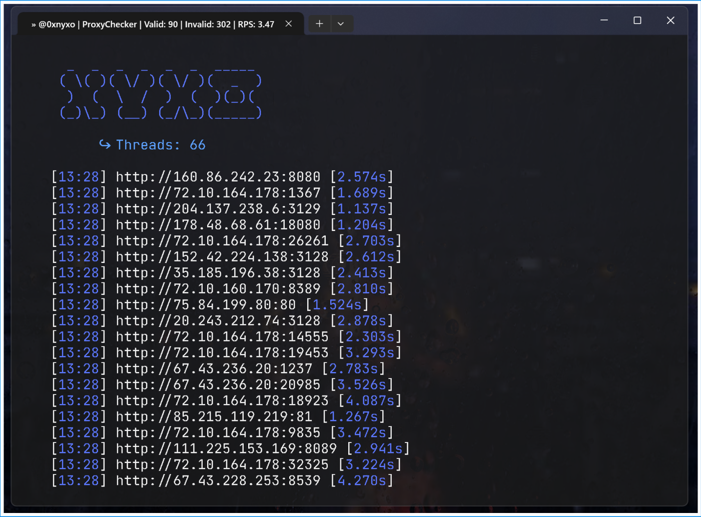

# ProxyChecker

## Overview

ProxyChecker is a multithreaded tool for validating HTTP & HTTPs proxies in real-time. It fetches a list of proxies from a given URL, checks their validity, and saves the valid proxies to a file. The tool displays results dynamically in the terminal, updating the terminal title with the current status.

## Features

- Fetches proxies from a specified URL.
- Validates proxies using multithreading.
- Displays real-time results in the terminal.
- Updates the terminal title with the current status.
- Saves valid proxies in real-time to a file.

## Saving Valid Proxies

Valid proxies are saved in real-time to `valid/valid_proxies.txt`.

## Contributing

Feel free to open issues or submit pull requests for improvements and bug fixes.

## License

This project is licensed under the MIT License - see the [LICENSE](LICENSE) file for details.

## Contact

For any inquiries, please contact @0xnyxo on Discord!

---

**Author**: [Your Name]

